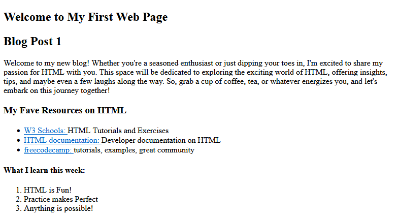
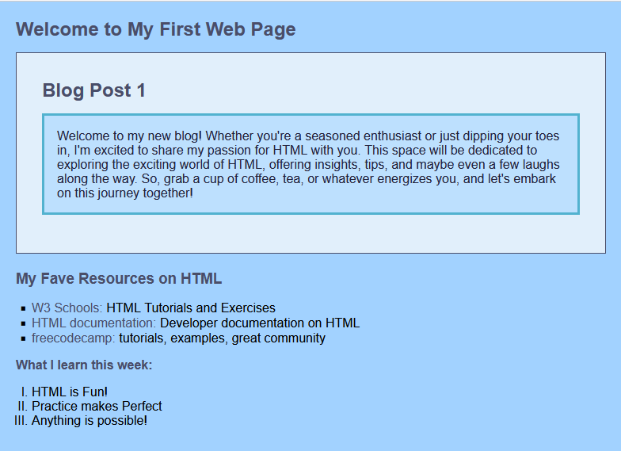

# Simple First Blog Site
Create your first blog site
 
This is what your blog site should look with HTML only:

 
This is what your blog site should look with some basic CSS:

 
This is created for basic HTML exercise,
covering:
- heading
- link
- list

***
## Branches
- activity2-1: Basic HTML
